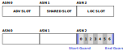
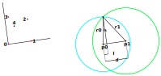

# 3D Location
Determining a node’s absolute location, that is location defined by latitude, longitude, and height on the earth, is a problem which typically requires satellites and GPS to solve. This mesh network however seeks to provide relative location, which is location relative to surrounding nodes. Relative location can be determined using the Time of Flight of signals (TOF) sent to neighboring nodes. There are two well known methods of using the TOF of signals to determine location: Time of Arrival (TOA), and Time Difference of Arrival (TDOA).

## Time of Arrival (TOA)
This network implements Single-Sided Ranging (SSR) to perform Time of Arrival. Using SSR, a transmitting node can measure the TOF to a receiving node via two measurements:

1. the time between transmitting a packet and receiving a response (TX TO ACK TIME) and

2. the time between the receiver receiving the packet and transmitting a response (TURNAROUND TIME).

The Time of Flight is TOF=((TX TO ACK TIME-TURNAROUND TIME))/2.

<p align="center">
	
	<br>
	<sub><em>Figure 6. Time of Flight (TOF) measurement.</em></sub>
</p>

This only allows the transmitting node to measure the TOF. The receiving node can perform the same procedure with the roles swapped, or the transmitting node can transmit the results of the measurement back to the receiving node. A node’s location can be determined by measuring the distance to multiple reference points and solving a geometry problem. Four distance measurements are required to determine location in 3D space. Three points, which define a plane, and a fourth point non-coplanar with the other three is the minimum number of measurements required to compute location.

<p align="center">
	
	<br>
	<sub><em>Time of Arrival (TOA).</em></sub>
</p>

The above figure is a 2D example (which requires 3 distance measurements instead of 4 for 3D). In this example, node 3 wants to determine its location using TOA. Node 3 measures the distance to nodes 0, 1, and 2 which all have defined locations. Each distance measurement represents a circle (sphere in 3D) centered at the appropriate node. The intersection of the circles (spheres in 3D) is the location of node 3.

### Single-Sided vs Double-Sided Ranging
<p align="center">
	
</p>

Time of Arrival can be measured using either single-sided ranging (SSR) or double-sided ranging (DSR).

From an accuracy standpoint, DSR is preferable as it is less susceptible to clock differences between the radios. Note that this can be mitigated in SSR by reducing the turnaround time.

From a power requirement, DSR requires more transmissions than SSR. The location update procedure seeks to measure the distance between all the beacons participating in the location update. Therefore, DSR at minimum requires double, and may require triple, as many transmissions than SSR.

Therefore, SSR was chosen to implement TOA.

## Time Difference of Arrival (TDOA)
TDOA works by measuring the difference in arrival times of packets instead of round trip time. Multiple TDOA measurements can be used to plot hyperbolas where the intersection is the location of the node. Note: a hyperbola is the set of all points such that the difference of distances from two fixed points (foci) is constant. Unlike TOA which requires nodes to both transmit and receive, TDOA only requires reception (or only transmission) of packets. This allows TDOA to provide location to an unlimited number of nodes in an area.

<p align="center">
	
	<br>
	<sub><em>Time Difference of Arrival.</em></sub>
</p>

For example, suppose that node 4 in the above figure wants to measure its location. By comparing the difference in arrival times of packets transmitted by nodes 0, 1, 2, 3, node 4 can plot 2 hyperbolas to determine its location. Note: TDOA requires one more node than TOA because TDOA cannot measure the true distance to any one node. Therefore one node (in this case node 0) acts as the time reference from which differences can be computed. In 3D, hyperbolas become two sheet hyperboloids.

## Location Update
Updating a node’s location follows this basic outline:
1.	Measure distances to beacons.
2.	Compute location using distances.
3.	Optimize beacons.

## Measuring Distance
This mesh network uses both TOA and TDOA to provide location. The main design goals were:
1.	Do not limit the number of nodes that can determine their location. This requires TDOA.
2.	Do not require the user to strategically place beacons. Nodes should autonomously provision themselves as beacons.

Terminology:
- Node: a device in the mesh network.
- Beacon: a node that specifically transmits during a location slot.
- Prime Beacon: a beacon that transmits the first and last packet in a location slot. The first packet provides a reference time for other beacons transmitting in the same location slot and nodes performing TDOA. The last packet contains the distances of the other beacons to the prime beacon.
- Nonprime Beacon: all other beacons that are not prime beacons.

A location slot has a different layout than the TSCH Shared slot. A location slot is divided into 7 equally spaced segments to allow for multiple beacons to take part in one slot. Beacons that transmit during a location slot are able to measure the true ranges to each other and are thus able to perform TOA. Nodes that overhear a location slot are able to use TDOA to determine their location.

<p align="center">
	
	<br>
	<sub><em>Location slot is further divided into 7 segments.</em></sub>
</p>

Dividing the location slot into 7 was chosen to
1.	Fit the necessary data into the maximum IEEE 802.15.4 frame size. More beacons requires larger frames (smaller frame size is better).
2.	Provide enough beacons for TDOA (more beacons is better).
3.	Minimize the time taken for a location update (less is better).
4.	Match the chosen geometry of the beacons (See Geometry of Beacons).

<br>
<sub><em>The following is an explanation of the location slot in detail.* Suppose the nodes shown in below want to update their location. Nodes 0, 1, 2, 3, have an initial location estimate and will transmit during the location slot (they are beacons). Node 4 wants to determine its position and is not a beacon. Distances between nodes are color coded. Note that this example only deals with 3 beacons when in actuality up to 6 beacons partake in a location slot</em></sub>

<p align="center">
	
	<br>
	<sub><em>Example node layout. Distances are color coded.</em></sub>
</p>

The objective of the location slot is to measure distances between beacons. This is achieved by measuring timestamps of received packets and sharing these timestamps with the other nodes in the slot. Timestamps are specified t_ij denoting the duration between receiving beacon i’s packet and beacon j’s packet. For example, t_24 is the time between beacon 2’s packet and node 4’s packet. The left subscript is always presented as the smaller one because t_ij should be the same as t_ji. That is, the travel time between beacon 0 and beacon 1 (t_01) should be the same as the travel time between beacon 1 and beacon 0 (t_10). Todo: t_01 and t_10 could be reported as different due to differences in clock rates between beacons. Perhaps there is a way to use this to generate more accurate timestamps?

Timestamps are stored in a jagged array.

<p align="center">
	
	<br>
	<sub><em>Timestamp array.</em></sub>
</p>

- Columns 1 to 5 represent timestamps between the beacons.
- Column 6 represents the final timestamps transmitted by the prime beacon.
- Column 7 represents the timestamps recorded by a particular node. For example, node k=4 would measure and store timestamps in this column.

Once the location slot is complete various equations can be applied to these timestamps to compute the final distances between the beacons, or to compute differences of distances in the case of regular nodes. **Note: in practice, some of these equations can be applied during the location slot to compute intermediate timestamps which allows column 6 to be omitted.**

Timestamps are generated on the UWB radio itself. The units of the timestamps are based on the UWB’s main system clock running at `499.2 MHz*128 = ~63.898 GHZ` for a time resolution of `~15.65 ps/count`. Multiplying by the speed of light converts time to distance. Thus the spatial resolution is `15.65 ps*c = 4.69 mm`.

This is the packet structure used during the location slot (LocBeacon):
```
typedef struct __packed {
    uint8_t addr[8];
    int32_t tstamp;
} LocTstamp;

typedef struct __packed {
    uint8_t   version;
    uint8_t   class;
    uint8_t   dir_slot_offset; /* The current location slot’s direction, slot, offset */
    uint8_t   _reserved;
    float     x,y,z;           /* Location estimate of the current node */
    float     r,t;             /* Hyperspace packet routing coordinates */
    uint32_t  nbrhood;         /* Bits [0-19] indicating other beacons in the neighborhood */
    LocTstamp nbrs[];          /* Addresses and timestamps of previous beacons */
} LocBeacon;
```

### Offset 0
<p align="center">
	
</p>

Nodes start the location slot with no state. The prime beacon, in this case node 0, transmits the first packet. This provides a starting reference timestamp for all other nodes in the location slot. This time reference will be shifted slightly for each node due to the travel time of the signal from node 0 to the other nodes.

### Offset 1
<p align="center">
	
</p>

Beacon 1 transmits next and appends the address of beacon 0 and the length of time between receiving prime beacon 0’s packet and transmitting beacon 1 (t_01). Every other node receives beacon 1’s packet and stores both t_01 and the measured timestamp when the packet was received t_1k.

### Offset 2
<p align="center">
	
</p>

Beacon 2 transmits next and appends the address of beacon 0 and t_02, and the address of beacon 1 and t_12 (t_02 is the duration between receiving the prime beacon and beacon 2 transmitting, t_12 is the duration as recorded by beacon 2 between receiving the prime beacon and receiving beacon 1). Every other node stores both t_02, t_12, and the timestamp when beacon 2 was received (t_2k). Note: beacon 1 does not necessarily need to store the timestamp t_2k.

### Offset 3
<p align="center">
	
</p>

Beacon 3 transmits next and appends addr 0 and t_03, addr 1 and t_13, and addr 2 and t_23. Every other node stores these values and the timestamp when beacon 3 was received t_3k.


### Offset 6
<p align="center">
	
</p>

The prime beacon transmits the final packet with its recorded addresses of the previous beacons and timestamps: t_1^', t_2^', t_3^'. The location slot is complete. The nodes and beacons must now perform corrections to the timestamps to determine actual distances. This is a summary of the location slot: at each offset, the beacon must transmit the address and recorded timestamps from all previous beacons.

```
Beacon 0:
Beacon 1: addr 0 + t_01
Beacon 2: addr 0 + t_02, addr 1 + t_12
Beacon 3: addr 0 + t_03, addr 1 + t_13, addr 2 + t_23
Beacon 4: addr 0 + t_04, addr 1 + t_14, addr 2 + t_24, addr 3 + t_34
Beacon 5: addr 0 + t_05, addr 1 + t_15, addr 2 + t_25, addr 3 + t_35, addr 4 + t_45
Beacon 6 (0): addr 1 + t_1^', addr 2 + t_2^', addr 3 + t_3^', addr 4 + t_4^', addr 5 + t_5^'
```
Note: the above does not deal with error handling (see [Error Handling](error-handling.md)).

### Summary
<p align="center">
	
</p>

First, nodes need to compute the distances from the prime beacon to other beacons. Note: a convention I use is for “t” to represent uncorrected timestamps and “d” to represent actual time of flight.

```
d_0j=((t_j^'-t_0j))/2
```

Distances reported by the prime node (t') are round trip times. Subtract the turnaround time (t_0j) to get the time of flight in both directions, and then divide by 2 to get the actual distance.

Next, the distances between the nonprime beacons can now be determined.

```
d_ij=t_ij-t_0i+d_0j-d_0i
```

The distances between the beacons have now been found. Beacons themselves can use TOA to compute their location. However, if a node is not a beacon, then the true distance cannot be determined. If performing TDOA, the distance equation becomes:

```
d_ik=t_ik-t_0i+d_0k-d_0i
p_ik=t_ik-t_0i-d_0i (pseudorange)
d_ik=p_ik+d_0k
```

For a node k, d_0k cannot be determined; only the pseudorange p_ik is known. A pseudorange is a distance measurement with an unknown offset, in this case d_0k. The location slot provides node 4 with 3 pseudoranges:

```
p_14=(t_14-t_01-d_01)+ d_04
p_24=(t_24-t_02-d_02)+d_04
p_34=(t_34-t_03-d_03)+d_04
```

The unknown offset d_04 can be removed by subtracting pseudoranges, resulting in differences in ranges between beacons:

```
p_14-p_24=((t_14-t_01-d_01)+d_04) - ((t_24-t_02-d_02)+d_04)
         = (t_14-t_01-d_01) - (t_24-t_02-d_02)
p_14-p_34=((t_14-t_01-d_01)+d_04) - ((t_34-t_03-d_03)+d_04)
         = (t_14-t_01-d_01) - (t_34-t_03-d_03)
```

These differences generate hyperbolas between the respective beacons. Node 4 lies at the intersection of these hyperbolas. Note: in 3D space, these hyperbolas become one sheet of a two sheeted hyperboloid.

## Geometry of Beacons
This is the algorithm for determining which nodes become beacons. The main design goals were:
1.	The algorithm should run on the nodes themselves and not use centralized processing.
2.	The algorithm should run without the user’s interaction. I.E. the algorithm should be autonomous.
3.	The algorithm should try and maintain connectivity for nodes in the network.

<p align="center">
	
	<br>
	<sub><em>Example mesh network. Red nodes have bootstrapped the network and define the coordinate system.</em></sub>
</p>

3D space is divided into a lattice like structure with an octahedral unit cell, ideally with a beacon at each lattice point. Note that the lattice structure is a purely virtual construct used to help organize nodes into beacons. The length of a segment in the lattice can be customized and should be sized such that each edge represents a beacon’s radio range.

This unit cell was chosen because
1.	It is simple. The conversion from actual location to a lattice point is straight forward.
2.	It facilitates expanding the mesh by providing enough neighboring beacons.

<p align="center">
	
	<br>
	<sub><em>Lattice unit cell. Beacons are ideally located at vertices.</em></sub>
</p>

Beacon indices are assigned to points in the lattice. A beacon’s index is used to identify it in a node’s neighborhood and to determine when a beacon should transmit during location updates. Beacon indices are classified into 2 sheets “A” and “B” which alternate based on Z-height. Even Z levels (Z0, Z2, Z4,…) are “A” sheets and odd Z levels (Z1,Z3,Z5,…) are “B” sheets. Beacons 0, 1, 2, 3 are prime beacons.

<p align="center">
	
	<br>
	<sub><em>Beacon index layout per sheet. Beacons are located at the center of the squares. Boxes that touch each other are within radio range.</em></sub>
</p>

Care needs to be taken in the assignment of beacon indices. The requirements are:
1.	A node should not touch two beacons with the same index. If a node neighbors two beacons with the same index (meaning they transmit at the same time) then a collision will occur during location updates. This will prevent location data from being received.
2.	All nodes should be neighbors to at least one prime beacon. Prime beacons are essential for computing location.
3.	The total number of beacons indices should be minimized.
The beacon numbering in the above figure, with beacons on a slight (1/3) diagonal, satisfies the requirements.

Furthermore, A and B sheets are offset from each other as the Z-height increases (this maximizes the coverage of prime beacons). Looking directly down on two sheets:

<p align="center">
	
	<br>
	<sub><em>Sheets A and B overlaid. Notice that an offset is applied to sheet B to maximize coverage of prime beacons (0,1,2,3).</em></sub>
</p>

The one last implementation detail is that the beacons in each sheet swap places as sheets are layered on top of each other in order to prevent conflicts in the Z direction. That is, comparing A sheets at Z level 0 and 2: beacon 0 at Z0 becomes beacon 1 at Z2. Likewise for B sheets at Z level 1 and 3: beacon 2 at Z1 becomes beacon 3 at Z3. The full layout is show below.

<p align="center">
	
	<br>
	<sub><em>Full layout of beacons. Notice swapped A and B sheets.</em></sub>
</p>

Beacon indices are also used by beacons to report the neighborhood status to other nodes. The presence of a beacon in a node’s neighborhood is reported by setting the bit in the `nbrhood` field corresponding to that beacon’s index. For example:

<p align="center">
	
</p>

```
           0         1
           01234567890123456789
Beacon 0:  10001000010000010001 = 0x88211
Beacon 4:  10001000010000000001 = 0x80211
Beacon 9:  10001000010000010001 = 0x88211
Beacon 15: 10000000010000010001 = 0x88201
Beacon 19: 10001000010000010001 = 0x88211
```

It is sometimes useful to refer to the relative position of one node to another. The relative positions are given below:

<p align="center">
	
	<br>
	<sub><em>Figure 25. Relative positions of beacons.</em></sub>
</p>

For example, the beacon in relative position 2 centered at beacon 9 is beacon 1. The relative vectors are given below. Another example: beacon 5, relative position 4 is 8.

```
static Vec3 vectors[] = {
    { 0.0f,       0.0f,       0.0f },   /* 0  */
    { 1.0f,       0.0f,       0.0f },   /* 1  */
    { 1.0f,       1.0f,       0.0f },   /* 2  */
    { 0.0f,       1.0f,       0.0f },   /* 3  */
    {-1.0f,       1.0f,       0.0f },   /* 4  */
    {-1.0f,       0.0f,       0.0f },   /* 5  */
    {-1.0f,      -1.0f,       0.0f },   /* 6  */
    { 0.0f,      -1.0f,       0.0f },   /* 7  */
    { 1.0f,      -1.0f,       0.0f },   /* 8  */
    { 1.0f/2.0f,  1.0f/2.0f,  1.0f },   /* 9  */
    {-1.0f/2.0f,  1.0f/2.0f,  1.0f },   /* 10 */
    {-1.0f/2.0f, -1.0f/2.0f,  1.0f },   /* 11 */
    { 1.0f/2.0f, -1.0f/2.0f,  1.0f },   /* 12 */
    { 1.0f/2.0f,  1.0f/2.0f, -1.0f },   /* 13 */
    {-1.0f/2.0f,  1.0f/2.0f, -1.0f },   /* 14 */
    {-1.0f/2.0f, -1.0f/2.0f, -1.0f },   /* 15 */
    { 1.0f/2.0f, -1.0f/2.0f, -1.0f },   /* 16 */
    { 0.0f,       0.0f,       0.0f }};  /* 17 (not in neighborhood) */
```

As mentioned above, a beacon’s index determines when the beacon transmits. The TSCH schedule contains a slotframe for 4 location slots. The location slot determines which prime beacon starts the slot: LOC SLOT 0 always starts with prime beacon 0, LOC SLOT 1 always starts with prime beacon 1 etc. Furthermore, to limit the total number of beacons that transmit in a location slot to 6, repeats of the location slotframe are divided into different “directions”. The directions are NE, N, NW, W, SW, S, SE, and E.

<p align="center">
	
</p>

The full order is:

```
            0   1   2   3   4   5
NE, SLOT 0: 0,  4,  13, 9,  18, 19
NE, SLOT 1: 1,  5,  12, 8,  19, 18
NE, SLOT 2: 2,  6,  15, 11, 17, 16
NE, SLOT 3: 3,  7,  14, 10, 16, 17

N,  SLOT 0: 0,  9,  14, 18, 15, 19
N,  SLOT 1: 1,  8,  15, 19, 14, 18
N,  SLOT 2: 2,  11, 13, 17, 12, 16
N,  SLOT 3: 3,  10, 12, 16, 13, 17

NW, SLOT 0: 0,  9,  5,  17, 14, 15
NW, SLOT 1: 1,  8,  4,  16, 15, 14
NW, SLOT 2: 2,  11, 7,  19, 13, 12
NW, SLOT 3: 3,  10, 6,  18, 12, 13

 W, SLOT 0: 0,  17, 7,  14, 6,  15
 W, SLOT 1: 1,  16, 6,  15, 7,  14
 W, SLOT 2: 2,  19, 4,  13, 5,  12
 W, SLOT 3: 3,  18, 5,  12, 4,  13
            0   1   2   3   4   5
SW, SLOT 0: 0,  17, 8,  12, 7,  6
SW, SLOT 1: 1,  16, 9,  13, 6,  7
SW, SLOT 2: 2,  19, 10, 14, 4,  5
SW, SLOT 3: 3,  18, 11, 15, 5,  4

S,  SLOT 0: 0,  12, 7,  11, 6,  10
S,  SLOT 1: 1,  13, 6,  10, 7,  11
S,  SLOT 2: 2,  14, 4,  8,  5,  9
S,  SLOT 3: 3,  15, 5,  9,  4,  8

SE, SLOT 0: 0,  12, 16, 4,  11, 10
SE, SLOT 1: 1,  13, 17, 5,  10, 11
SE, SLOT 2: 2,  14, 18, 6,  8,  9
SE, SLOT 3: 3,  15, 19, 7,  9,  8

 E, SLOT 0: 0,  4,  11, 18, 10, 19
 E, SLOT 1: 1,  5,  10, 19, 11, 18
 E, SLOT 2: 2,  6,  8,  17, 9,  16
 E, SLOT 3: 3,  7,  9,  16, 8,  17
```

For example, if NE SLOT 0 is active, prime beacon 0 will transmit in offset 0, beacon 4 will transmit in offset 1, beacon 9 will transmit in offset 2, beacon 13 will transmit in offset 3, beacon 18 will transmit in offset 4, beacon 19 will transmit in offset 5, and prime beacon 0 will transmit last in offset 6 (implied, not explicitly listed above). The groupings, E, NE, N etc. were chosen so that eventually all interbeacon distances could be computed. The figure below shows the beacons active during the different directions around prime beacon 0.

<p align="center">
	
</p>

The relative positions was applied to other prime beacons to determine the groupings and the order:

<p align="center">
	
</p>

## Computing Location Using Distances
There are multiple algorithms which can be used to determine a node’s location. This is the decision tree:

```
/* Nominal */
if number of neighboring beacons >= 4
    if transmitted beacon and have location estimate
        compute location using springs
    else if number of beacons in update >= 5 and not coplanar and transmitted beacon
        compute location using toa
    else if number of beacons in update >= 5 and not coplanar and did not transmit
        compute location using tdoa
    else if number of beacons in update >= 4 and transmitted beacon
        compute location using intersection of 3 spheres
/* Bootstrap */
else if neighbors with (0, 0, 0) and number of root’s neighbors <= 4
	if transmitted beacon and beacon index == 0
		location = 0, 0, 0
	else if transmitted beacon and beacon index == 4
		compute location using line
	else if transmitted beacon and beacon index == 9
		compute location using intersection of 2 circles
	else if transmitted beacon and beacon index == 13
		compute location using intersection of 2 circles
else
	lost location
```

Nodes have no location when creating a new mesh network. Therefore, a bootstrap process is required to distribute location information. One node, typically the border router, sets its initial location to (0, 0, 0) and starts transmitting beacons. Also, the initial beacon will have no neighbors. The bootstrap procedure runs if nodes are neighbors with (0, 0, 0) and if there are less than 4 beacons in the neighborhood (4 beacons are required to compute location for TOA).

### 2 Beacons (Line)
Nodes then randomly try and transmit in offset 1. If acknowledged by the prime beacon, then the node is established as a beacon. This first node defines the x-axis.

<p align="center">
	
</p>

The algorithm for the location of the first node is simple:

```
x = d01 * DW1000_TIME_RES * SPEED_OF_LIGHT;
y = 0;
z = 0;
```

### 3 Beacons (Intersection of 2 Circles)
Nodes then randomly try and transmit in offset 2. If acknowledged by the other beacons, then the node is established as a beacon. This second node defines the y-axis.

<p align="center">
	
</p>

Two distances from two points results in 2 circles. This is the algorithm to find the point corresponding to +y:
```
Let p0 be a 3D vector representing the location of beacon 0
    p1 be a 3D vector representing the location of beacon 1
    r0 be the measured distance to beacon 0
    r1 be the measured distance to beacon 1

v = p1 – p0
d = norm(v)
l = (r0^2 – r1^2 + d^2) / (2*d)
h = sqrt(r0^2 – l^2)

x = l/d * v.x – h/d * v.y + p0.x
y = l/d * v.y + h/d * v.x + p0.y
z = 0
```

### 4 Beacons (Intersection of 3 Spheres)
<p align="center">
	
</p>

The third node that joins potentially defines the +z-axis. Three distances, in 3D space, define 3 spheres with potentially 2 intersection points (underdetermined). The intersection of 3 spheres is:

```
Let p0 be a 3D vector representing the location of beacon 0
    p1 be a 3D vector representing the location of beacon 1
    p2 be a 3D vector representing the location of beacon 2
    r0 be the measured distance to beacon 0
    r1 be the measured distance to beacon 1
    r2 be the measured distance to beacon 2

v1  = p1 – p0
v2  = p2 – p0
d   = norm(v1)        /* norm(v) = sqrt(v.x^2 + v.y^2 + v.z^2) */

u1  = v1 / d          /* unit vector along v1 */
e   = v2 . u1         /* Local x coordinate of v2 */

rej = v2 – u1 / e     /* rej(v2,v1) = v2 – proj(v2,v1) = v2 – (e*u1) */
f   = norm(rej)       /* Local y coordinate of v2 */
u2  = rej / f         /* Second unit vector along rej */
u3  = u1 x u2         /* Third unit vector */

/* Solution for the particular case when p0 = (0,0,0), p1 = (d,0,0), p2 = (e,f,0) */
l = (r0^2 – r1^2 + d^2) / (2*d)
w = (r0^2 – r2^2 – 2*e*l + e^2 + f^2) / (2*f)
h = sqrt(r0^2 – l^2 – w^2)
```

Intersection of 3 spheres is used extensively to compute location, not just during bootstrapping. Intersection of 3 spheres is used to help grow and extend the mesh network beyond the initial bootstrapping nodes. The intersection of 3 spheres produces 2 solutions. Therefore, an estimate of the final beacon index is required to disambiguate the final solution. Neighborhood information can be used to estimate what the final beacon index is, and where the relative position should be since the beacons form a regular lattice. For example:

<p align="center">
	
	<br>
	<sub><em>Example of how neighborhood information can be used to estimate a new beacon's index.</em></sub>
</p>

Suppose a beacon is joining the network and is located near beacon index 15. The joining beacon does not have location information yet and can’t determine its beacon index. However, the joining beacon can infer its beacon index based on the local neighborhood’s connectivity. The joining node has beacons 0, 9, 19 in its local neighborhood. Based on the relative positions of 0, 9, 19, the candidates for the joining node are 13 and 15.

However, beacons 0, 9, 19 report a neighborhood that includes 4. The joining node does not hear beacon 4 and thus candidate 13 is rejected. Therefore the joining node can infer that it is located at beacon index 15. With this estimate, the solution to the 3 sphere intersection problem must place the final location towards 15, and away from 4.

Here is how the location for beacon 15 can still be determined:

The expected relative positions of the beacons can be estimated based on the lattice structure.

- Beacon 0 is located at p_0=(0,0,0)
- Beacon 4 should be located at (1, 0, 0)
- Beacon 9 should be located at v_01=(0,1,0)
- Beacon 19 should be located at v_02=(0.5,0.5,1)
- Beacon 15 should be located at v_03=(-0.5,-0.5,1)

The triple product of v01, v02, v03 indicates if the solution is along (+) or opposite (-) the u3 basis.

`triple=v_03∙(v_01×v_02)`

The final solution is then

`sol=p_0 + (l*u_1) + (w*u_2) + (h*sign(triple)*u_3)`

### 5+ Beacons (TOA Over-Constrained)
The equations of circles where measured distances may be imprecise are:

```
(x0 - x)^2 + (y0 - y)^2 + (z0 - z)^2 = d0^2
(x1 - x)^2 + (y1 - y)^2 + (z1 - z)^2 = d1^2
(x2 - x)^2 + (y2 - y)^2 + (z2 - z)^2 = d2^2
(x3 - x)^2 + (y3 - y)^2 + (z3 - z)^2 = d3^2
```

Expanded:

```
x0^2 - 2x*x0 - x^2 + y0^2 - 2y*y0 + y^2 + z0^2 - 2z*y0 + z^2 = d0^2
x1^2 - 2x*x1 - x^2 + y1^2 - 2y*y1 + y^2 + z1^2 - 2z*y1 + z^2 = d1^2
x2^2 - 2x*x2 - x^2 + y2^2 - 2y*y2 + y^2 + z2^2 - 2z*y2 + z^2 = d2^2
x3^2 - 2x*x3 - x^2 + y3^2 - 2y*y3 + y^2 + z3^2 - 2z*y3 + z^2 = d3^2
```

Subtract equations 2,3,4 from equation 1:

```
(x0-x1)*x + (y0-y1)*y + (z0-z1)*z = 1/2 * (x0^2-x1^2 + y0^2-y1^2 + z0^2-z1^2 + d1^2-d0^2)
(x0-x2)*x + (y0-y2)*y + (z0-z2)*z = 1/2 * (x0^2-x2^2 + y0^2-y2^2 + z0^2-z2^2 + d2^2-d0^2)
(x0-x3)*x + (y0-y3)*y + (z0-z3)*z = 1/2 * (x0^2-x3^2 + y0^2-y3^2 + z0^2-z3^2 + d3^2-d0^2)
```

The system of equations is overdetermined. Represent the system of equations in matrix form:

```
Ax = b

A = {
	{ x0-x1, y0-y1, z0-z1 },
	{ x0-x2, y0-y2, z0-z2 },
	{ x0-x3, y0-y3, z0-z3 },
}

b = {
	{ 1/2 * (x0^2-x1^2 + y0^2-y1^2 + z0^2-z1^2 + d1^2-d0^2) },
	{ 1/2 * (x0^2-x2^2 + y0^2-y2^2 + z0^2-z2^2 + d2^2-d0^2) },
	{ 1/2 * (x0^2-x3^2 + y0^2-y3^2 + z0^2-z3^2 + d3^2-d0^2) },
}

x = [ x y z ]'
```

The solution is:

```
    x = (A' * A)^-1 * A' * b
```

Which can be solved with QR decomposition:

```
    A = Q1 * R1

    R1 * x = Q1' * b
```

### 5+ Beacons (Spring Relaxation)
<p align="center">
	
</p>

This is the main function used by beacons to compute location once an initial location estimate is generated. There is always noise in the distance measurements. The error compounds and causes the computed location to drift. This drift can be mitigated with some assumptions:

1.	Beacons don’t typically move (they have a fixed location).
2.	Beacons are arranged in a lattice (they have an ideal location).

This function works by simulating a system of springs connected between this beacon and the neighboring beacons with a natural length equal to the measured distance to the respective beacon. In addition, a small, constant attracting force in the direction of the ideal location of this beacon is applied. It’s this small extra force which counteracts the drift. The forces are computed and applied with a small time step to update the location. The small time step also acts to help filter the location estimate.

```
#define Ks  (1.0f)	/* Spring constant       */
#define Kg  (0.2f)	/* Lattice point gravity */
#define B   (2.0f)	/* Damping factor        */
#define M   (1.0f)	/* Mass                  */
#define dt  (0.01f)	/* Simulation time step  */

Vec3 a = 0;

/* Acceleration due to springs between beacons */
foreach(beacon b in update)
{
	Vec3  v   = this.loc - b.loc;
	float mag = norm(v);

	if(isfinite(mag) && mag != 0)
	{
		Vec3 u = v / mag;	/* Unit vector towards beacon b's location */
		a += Ks * (dist(this.loc, b.loc) * u - v) / M;
	}
}

/* Acceleration towards this beacon's closest lattice point */
Vec3 x0 = this.loc;
Vec3  g = quantize_to_grid(x0);
Vec3 ug = unit(g - x0);

/* Apply constant attraction to the closest lattice point. Also apply damping which opposes this beacon's velocity. */
a += (Kg * ug / M) - (B * this.velocity / M);

/* Apply time step to acceleration to update this node's velocity */
this.vel += a * dt;

/* Apply time step to velocity to update this node's position */
x0 += this.vel * dt;
```

### 5+ Beacons (TDOA Over-constrained)
Difference of distances:

```
d1 = delta_10 + d0
d2 = delta_20 + d0
d3 = delta_30 + d0
```

Equivalent equations as TOA but with d1, d2, d3 substituted.

```
(x0-x1)*x + (y0-y1)*y + (z0-z1)*z =
	1/2 * (x0^2-x1^2 + y0^2-y1^2 + z0^2-z1^2 + delta_10^2 + 2*delta_10*d0)
(x0-x2)*x + (y0-y2)*y + (z0-z2)*z =
	1/2 * (x0^2-x2^2 + y0^2-y2^2 + z0^2-z2^2 + delta_20^2 + 2*delta_20*d0)
(x0-x3)*x + (y0-y3)*y + (z0-z3)*z =
	1/2 * (x0^2-x3^2 + y0^2-y3^2 + z0^2-z3^2 + delta_30^2 + 2*delta_30*d0)
```

Represent the system of equations in matrix form:

```
Ax = b1 + (b2 * d0)

A = {
	{ x0-x1, y0-y1, z0-z1 },
	{ x0-x2, y0-y2, z0-z2 },
	{ x0-x3, y0-y3, z0-z3 },
}

b1 = {
	{ 1/2 * (x0^2-x1^2 + y0^2-y1^2 + z0^2-z1^2 + delta_10^2) },
	{ 1/2 * (x0^2-x2^2 + y0^2-y2^2 + z0^2-z2^2 + delta_20^2) },
	{ 1/2 * (x0^2-x3^2 + y0^2-y3^2 + z0^2-z3^2 + delta_30^2) },
}

b2 = {
	{ delta_10 },
	{ delta_20 },
	{ delta_30 },
}

x = (A' * A)^-1 * A' * (b1 + b2 * d0)
```

Which can be solved with QR decomposition:

```
A = Q1 * R1

R1 * x = Q1' * [b1 b2]
```

The solution will have the form:

```
xs = a + b*d0    x[0][0] + x[0][1] * d0
ys = c + d*d0 -> x[1][0] + x[1][1] * d0
zs - e + f*d0    x[2][0] + x[2][1] * d0
```

Find d0 by solving:

```
(x - x0)^2 + (y - y0)^2 + (z - z0)^2 = d0^2
```

Plug in the formulas for x, y, z:

```
=> (a + b*d0 - x0)^2 + (c + d*d0 - y0)^2 + (e + f*d0 - z0)^2 = d0^2
=> (m + b*d0)^2      + (n + d*d0)^2      + (o + f*d0)^2      = d0^2, where:

	m = a - x0
	n = c - y0
	o = e - z0

=> m^2 + 2m*b*d0 + b^2*d0^2 + n^2 + 2n*d*d0 + d^2*d0^2 + o^2 + 2o*f*d0 + f^2*d0^2 = d0^2
=> b^2*d0^2 + d^2*d0^2 + f^2*d0^2 + 2m*b*d0 + 2n*d*d0 + 2o*f*d0 + m^2 + n^2 + o^2 = d0^2
=> (b^2 + d^2 + f^2 - 1)*d0^2 + (2m*b + 2n*d + 2o*f)d0 + (m^2 + n^2 + o^2) = 0
	^^^^^^^^^^^^^^^^^^^          ^^^^^^^^^^^^^^^^^^       ^^^^^^^^^^^^^^^
	A                            B                        C

	A = b*b + d*d + f*f - 1  = x[0][1]*x[0][1] + x[1][1]*x[1][1] + x[2][1]*x[2][1] - 1
	B = 2(m*b + n*d + o*f)   = 2(m*x[0][1] + n*x[1][1] + o*x[2][1])
	C = m*m + n*n + o*o      = m*m + n*n + o*o

=> d0 = (-B +/- sqrt(B^2 - 4 * A * C)) / (2*A)
```

Pick d0 to be positive and plug d0 back in to find x, y, and z.

```
xs = a + b*d0
ys = c + d*d0
zs - e + f*d0
```

## Optimizing Beacons
Once a node has updated its location, it checks if it should become a beacon. The beacon lattice maps location to beacon index.

<p align="center">
	
</p>

For example:
	A node located at (0, 0, 0) should be beacon index 0.
	A node located at (R, 0, 0) should be beacon index 4.
	A node located at (R, R, 0) should be beacon index 13.

Note: R is a parameter setting the length of one segment in the lattice. It is a chosen parameter which should be chosen to roughly represent the radio distance of a node.

Therefore, a node can determine which beacon index it’s closest to once its location has been calculated. Nodes calculate the distance between themselves and the closest lattice point and compare that distance to the existing beacon.

<p align="center">
	
	<br>
	<sub><em>Beacons are marked with a black dot. The beacon’s ideal location is marked with a black line.</em></sub>
</p>

A node will try to replace an existing beacon if it is closer to the lattice point than the existing beacon. It does this by starting a timer with a duration set proportional to the distance to lattice point. The new node will start transmitting beacons in the desired slot once the timer completes. Note: transmitting in the same slot causes a collision with the existing beacon which causes the existing beacon to backoff. The timer is used so that nodes closer to the lattice point will transmit sooner than nodes farther away.

<p align="center">
	
	<br>
	<sub><em>Two nodes located near the same ideal beacon location. The blue node is located closer to the ideal location than the black node. When trying to become beacons, the blue node starts a timer with a shorter period than the black node increasing its chances of transmitting a successful beacon packet first.</em></sub>
</p>

An existing beacon will stop beaconing if it detects that a new beacon is closer to the lattice point. Hysteresis is added to prevent multiple nodes located at roughly the same distance from the ideal point from continuously transmitting beacon packets at the same time. A new beacon needs to be at least 25% closer to the lattice point than an existing beacon.

The whole goal of this procedure is for the nodes to automatically choose which nodes become beacons by trying to get beacons as to match the lattice as close as possible.

Here’s an example: suppose nodes are randomly distributed in an area as shown in below. The red nodes are the nodes that have bootstrapped the mesh and which have defined the coordinate system for the mesh.

<p align="center">
	
	<br>
	<sub><em>Example mesh network. Red nodes define the coordinate system.</em></sub>
</p>

Nodes closest to the lattice points are marked red in the figure below with a line drawn from the node to the lattice point. These nodes are the best candidates to be beacons.

<p align="center">
	
	<br>
	<sub><em>Example mesh network. Red nodes are optimized beacons.</em></sub>
</p>
