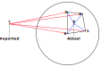
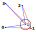
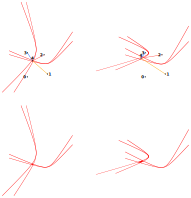

# Error Handling
## Conflicts During Location Update
The data transmitted during a location slot is summarized as:

```
Beacon 0:
Beacon 1: addr0 t01
Beacon 2: addr0 t02   addr1 t12
Beacon 3: addr0 t03   addr1 t13   addr2 t23
Beacon 4: addr0 t04   addr1 t14   addr2 t24    addr3 t34
Beacon 5: addr0 t05   addr1 t15   addr2 t25    addr3 t35    addr4 t45
Beacon 6:             addr1 t’1   addr2 t’2    addr3 t’3    addr4 t’4   addr5 t’5
```

Addresses are included in the LocBeacon packet to detect potential conflicts if two beacons transmit in the same offset. The sequence as presented above allows later beacons to notify an earlier beacon of a conflict, either by clearing the address or setting the timestamp to the maximum value. However, earlier beacons cannot notify later beacons of a conflict. For example beacon 1 cannot notify beacon 5 of a conflict in beacon 5. To fix this, expected addresses and timestamps are included in LocBeacon packets (expected timestamps are included to maintain the length of the packet but may not necessarily have meaning beyond the values of 0 and -1).

```
Beacon 0:             exp1 0/-1   exp2 0/-1    exp3 0/-1    exp4 0/-1   exp5 0/-1
Beacon 1: addr0 t01               exp2 0/-1    exp3 0/-1    exp4 0/-1   exp5 0/-1
Beacon 2: addr0 t02   addr1 t12                exp3 0/-1    exp4 0/-1   exp5 0/-1
Beacon 3: addr0 t03   addr1 t13   addr2 t23                 exp4 0/-1   exp5 0/-1
Beacon 4: addr0 t04   addr1 t14   addr2 t24    addr3 t34                exp5 0/-1
Beacon 5: addr0 t05   addr1 t15   addr2 t25    addr3 t35    addr4 t45
Beacon 6:             addr1 t’1   addr2 t’2    addr3 t’3    addr4 t’4   addr5 t’5
```

1.	If a beacon is not expected, then the expected address will be 0.
2.	If a beacon is expected and was successfully received last time, then the expected address will be set and the timestamp will be 0.
3.	If a beacon is expected and was not successfully received last time, then the expected address will be set and the timetstamp will be set to -1.

For example, if the two beacons transmitted in slot 5 last time the slot was active, beacon 1 would report this the next time this slot is active either by clearing exp5 (expected address 5) or setting the exp5 timestamp to -1. The beacons that transmitted in slot 5 would then recognize that there was a conflict and back off.

## Inconsistencies in Beacon Location
It is assumed that a beacon’s location is relatively fixed. If a beacon reports a location that is different from its actual location, then other node’s locations will be impacted. Therefore, each node must verify that the measured distances match the distances expected from the reported location.

Each node verifies that a beacon is within its neighborhood. Because of the size of the lattice, each beacon should be within about `√3*R` of each other where R is the lattice length. A beacon may report a non-local location if it was moved to a new location by the user. Therefore, beacons are outright ignored if their reported location is larger than `√3*R` from a node’s location.

However, the moved beacon itself needs to detect that it has an incorrect location. Therefore, a majority system is used to determine if a node’s location is incorrect. If the majority of the surrounding beacons report a non-local location, then a node should determine that it has an inaccurate location.


*Example of large error. Beacon 4 has moved and reports a far away location. Beacons 0,1,2,3 recognize that 4’s location is not within the local neighborhood and ignore beacon 4. Beacon 4 recognizes that it has an inconsistent location by determining that the majority of its neighbors now report a non-local neighborhood. Beacon 4 must recalculate it’s location. Non-local beacons are beacons roughly outside the indicated circle.*

Another source of errors is if a beacon is moved slightly so that the reported location differs from the actual location. This can be detected by checking that the measured distances roughly match the distances between reported locations. If the majority of the measured distances are within 0.3 of the expected distances between reported locations, then the beacon’s location is deemed incorrect and that beacon is ignored. In this case, the moved beacon updates its location as normal so the beacon’s location estimate should converge to the actual location eventually.

Note: the above values, √3*R for a local neighborhood and 0.3 for expected locations, are roughly chosen and could change with future testing.


*Example of small error. Beacon 1’s actual location is >0.3 from it’s reported location. Beacons 0,2,3 ignore Beacon 1.*

## Dilution Of Precision (DOP)
Dilution of Precision occurs when the geometry of the beacons degrades the accuracy of the location measurement. DOP affects TOA to an extent, but is extremely pronounced in TDOA, especially when the distance between beacons is small. Errors in measuring difference of distances can be represented by superimposed hyperbolas forming an area. As the node’s actual location moves further away from the location beacons, the node moves further into an ever expanding area of uncertainty. Therefore a node needs to be located in a region bounded by beacons in order to accurately determine its location. This effect is extremely pronounced such that a node cannot determine its location even if it is located just barely outside a beacon bounded region.


*Dilution of precision. Notice that the intersection of the two noisy hyperbolas is larger on the right. In practice, DOP is more extreme than illustrated in this example to the point that location cannot be computed outside an area bounded by beacons. (Left) Accurate location measurement. Node 4 is inside the area bounded by beacons 0,1,2,3. (Right) Inaccurate location measurement. Node 4 is outside the area bounded by beacons 0,1,2,3.*

If a node is trying to compute its location via TDOA it’s possible that the location is inaccurate. However, the node can detect if its location estimate is inaccurate and can try and remedy the problem by measuring the distance to the prime beacon outside of the location slot. Note: in order to turn TDOA into TOA, just the distance to the prime beacon, in this case d_04 is needed.
```
p_14=(t_14-t_01-d_01 )+ d_04
p_24=(t_24-t_02-d_02 )+d_04
p_34=(t_34-t_03-d_03 )+d_04
```

Therefore, the whole sequence of measuring location in the presence of DOP is:
1. Store timestamps as measured during a location slot.
2. Send a packet to the prime beacon in the shared slot.
3. On ACK, compute the distance to the prime beacon.
4. Continue computing location as normal.
