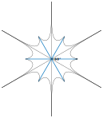
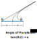
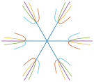
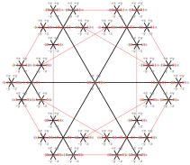
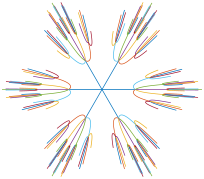
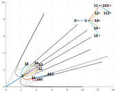
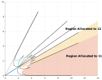

# Mesh Routing
Standard routing protocols for IPv6 over Low power Wireless Personal Area Networks (6LoWPAN) focus primarily on data collection tasks. The main algorithm is RPL which builds a tree-like topology. RPL is well suited for applications where nodes need to send data to a root node. However, the main drawback with RPL is that nodes need to store redundant routing tables at each level in the tree to enable routing from node to node.

Routing in the Hyperspace mesh network uses a form a geometric routing where node's assign coordinates to themselves based roughly on their location in the network. The benefit of using coordinates to perform routing is that each node can globally route packets with only local information. This means that minimal state needs to be kept in each node; each node only needs to know the coordinates of its neighbors in order to route packets. The downside is that additional data needs to be inserted into each packet and that math needs to be done for each hop.

Coordinates are inserted into IPv6 packets using a Hop-By-Hop extension header.

```
 0                   1                   2                   3
 0 1 2 3 4 5 6 7 8 9 0 1 2 3 4 5 6 7 8 9 0 1 2 3 4 5 6 7 8 9 0 1
+-+-+-+-+-+-+-+-+-+-+-+-+-+-+-+-+-+-+-+-+-+-+-+-+-+-+-+-+-+-+-+-+
|Version| Traffic Class |           Flow Label                  |
+-+-+-+-+-+-+-+-+-+-+-+-+-+-+-+-+-+-+-+-+-+-+-+-+-+-+-+-+-+-+-+-+
|         Payload Length        |  Next Header  |   Hop Limit   |
+-+-+-+-+-+-+-+-+-+-+-+-+-+-+-+-+-+-+-+-+-+-+-+-+-+-+-+-+-+-+-+-+
|                                                               |
+                                                               +
|                                                               |
+                         Source Address                        +
|                                                               |
+                                                               +
|                                                               |
+-+-+-+-+-+-+-+-+-+-+-+-+-+-+-+-+-+-+-+-+-+-+-+-+-+-+-+-+-+-+-+-+
|                                                               |
+                                                               +
|                                                               |
+                      Destination Address                      +
|                                                               |
+                                                               +
|                                                               |
+-+-+-+-+-+-+-+-+-+-+-+-+-+-+-+-+-+-+-+-+-+-+-+-+-+-+-+-+-+-+-+-+
|  Next Header  |  Hdr Ext Len  | Opt Type      | Opt Length    |
+-+-+-+-+-+-+-+-+-+-+-+-+-+-+-+-+-+-+-+-+-+-+-+-+-+-+-+-+-+-+-+-+
| Src Coord Seq | Dst Coord Seq | Packet ID                     |
+-+-+-+-+-+-+-+-+-+-+-+-+-+-+-+-+-+-+-+-+-+-+-+-+-+-+-+-+-+-+-+-+
| Source Coordinate (Radius)                                    |
+-+-+-+-+-+-+-+-+-+-+-+-+-+-+-+-+-+-+-+-+-+-+-+-+-+-+-+-+-+-+-+-+
| Source Coordinate (Theta)                                     |
+-+-+-+-+-+-+-+-+-+-+-+-+-+-+-+-+-+-+-+-+-+-+-+-+-+-+-+-+-+-+-+-+
| Destination Coordinate (Radius)                               |
+-+-+-+-+-+-+-+-+-+-+-+-+-+-+-+-+-+-+-+-+-+-+-+-+-+-+-+-+-+-+-+-+
| Destination Coordinate (Theta)                                |
+-+-+-+-+-+-+-+-+-+-+-+-+-+-+-+-+-+-+-+-+-+-+-+-+-+-+-+-+-+-+-+-+

IPv6 Next Header
0 (Hop-By-Hop)

Opt Type
0x22 (Hyperspace coordinate)

Src Coord Seq (8-bits)
	Sequence number for the source coordinate

Dst Coord Seq (8-bits)
	Sequence number for the destination coordinate

Packet ID (16-bits)
	Unique ID generated per packet. If the packet is fragmented, each fragment contains the same packet ID. The packet id is used to avoid redundant retransmits when flooding packets.

Source Coordinate (Radius, Theta)
	The coordinate of the packet's source.

Destinaion Coordinate (Radius, Theta)
	The coordinate of the packet's destination.
```

Sequence numbers are used to determine if a packet's coordinates are new. A node updates its own coordinate and increments its own sequence number when the node's coordinate changes (possibly because the node has moved).

An intermediate node may update the packet's source or destination coordinate if the intermediate node has a newer entry for either source or destination than the packet. If an intermediate node receives a packet with a newer source or destination coordinate, then it updates its own routing entry and leaves the packet unchanged. Note that an intermediate node may not necessarily have a routing table entry for either the packet's source or destination. In this case, the intermediate node routes the packet as normal.

### Sending A Packet
When a node originates a packet, it appends the Hyperspace Routing Hop-By-Hop option and sets the source coordinate and sequence number. The node has a small routing table with (Dest IP, Dest Coord) pairs that it consults to set the packet's destination coordinate and sequence number. Finally the node sets the Packet ID field in the Hyperspace Routing option.

If a node does not have a routing table entry for the destination, then the node sets the destination coordinate to NAN which causes the packet to be flooded. Each intermediate node caches the packet's source ip address and packet id before sending. Then each intermediate node that receives the packet randomly retransmits the packet a number of times. Neighboring nodes retransmitting the same packet are detected by checking the packet id cache to prevent run-away flooding of the same packet over and over.

If a packet is sent to the mesh from outside the mesh, e.g. from the user's phone or through the internet, the border router adds the Hyperspace Routing Hop-By-Hop option to the packet. The source coordinate is set to (0,0) and the destination coordinate is found in the border router's routing table or set to NAN if the there is no entry in the routing table. The packet may be fragmented by the nodes in the mesh if the packet is to big. Packets are also compressed using 6LOWPAN.

### Hyperbolic Coordinates
Every network graph can be embedded in the hyperbolic plane such that for every two nodes x and t, there exists a neighbor y of x such that d(y,t) < d(x,t). In other words, this means that a graph can be embedded into the hyperbolic plane where the relationships between nodes can be represented by the distances between points in the plane. The hyperbolic plane is described by the following equations:

```
Hyperboloid Model (Minkowski Space):
x0^2 + x1^2 - x2^2 = -1

Bilinear Form:
B(x,y) = x0*y0 + x1*y1 - x2*y2

Polar Parameterization:
x = sinh(r)*cos(θ)
y = sinh(r)*sin(θ)
z = cosh(r)

r = acosh(z)
θ = atan(y/x)

Distance:
d(x,y) = arccosh(B(x,y)) = arccosh(x0*y0 + x1*y1 - x2*y2)
d((r0,θ0), (r1,θ1)) = arccosh(cosh(r0)*cosh(r1) - sinh(r0)*sinh(r1)*cos(θ1 - θ0))
```

Hyperbolic coordinates are assigned roughly based on a node's physical location. First form a graph by progressively dividing the hyperbolic plane into 60 degree sectors.



Next, set the length of each connection in the graph such that equal area is assigned to each child in the graph. The length is derived from the "angle of parallelism". Suppose there is a line in the hyperbolic plane with a perpendicular line segment with length x. The "angle of parallelism" is the smallest angle from the perpendicular which meets the original line at infinity. Doubling the perpendicular to the other side of the original line means that the same angle is assigned to both sides of the perpendicular line segment (see below).



Therefore, for a 60 degree sector:

```
sector = 60 degrees
theta  = sector / 2 = 30 degrees

   tan(theta/2) = e^-x
=> x = -ln(tan(theta/2))
=> x = -ln(tan(30 degrees/2))
=> x = -ln(tan(15 degrees))
=> l = 2*x = -2*ln(tan(15 degrees)) ~= 2.634
```

The resulting star graph can be copied and translated to form a larger graph.



Next, a node quantizes its location coordinate to the beacon grid. This quantized location will be used to compute the node's hyperbolic coordinates.

Finally, map quantized (x,y,z) coordinates to hyperbolic (r,theta) coordinates in the following way: Each branch of the hyperbolic graph is assigned either a +x, +y, +z, -x, -y, -z direction. For example, (2,0,0) would correspond to two units in 0 degree direction in the graph. A node then computes its hyperbolic coordinates by traversing the graph by sorting it's location coordinates in descending order from largest magnitude to smallest magnitude. That is, if a node's location is (2, -1, -3), then the hyperbolic coordinate is found by traversing:

```
3 units in the -z direction (320°), then
2 units in the +x direction (0°),   then
1 unit  in the -y direction (240°)
```

Note: There is a drawback with the scheme highlighted above in that there are many redundant mappings of physical (x,y,z) locations to hyperbolic (r,theta) coordinates. The method above was chosen because it was simple and seemed to work in a small test network. Whether it scales to larger networks is an open question. There may be better ways to assign hyperbolic coordinates to a node. For example, a node could take into account neighboring nodes and try and assign coordinates close to them.



The picture above does not show the distortion caused by the hyperbolic plane. The graph actually looks something like the following image. (Note: the graph below plots the raw (r,theta) coordinates instead of using a model like the Poincare Disk Model or the Upper Half Plane model so distances and areas aren't accurately represented.)



Below is an example embedding of a network. The network is shown diagramatically in the top right. Black lines mark the regions assigned to each node.





When a packet is routed, at each hop a node checks its local neighborhood and compares the distance between the next hop and the packet's destination. The node then transmits the packet via the next hop which is closest to the destination. Distance is computed using the polar hyperbolic distance equation above.

In this implementation, nodes do not attempt to build a complete local neighborhood but instead only store neighboring location beacons. Therefore, when a source node transmits a packet and the packet is destined outside the node's local neighborhood, the source node will transmit via a location beacon. Beacons likewise only track other beacons. Therefore routing happens via beacons. Finally, when a packet reaches its destination, which is determined when no other neighbor is closer to the destination than the current node, the current node transmits the packet to the local neighborhood assuming the destination node can overhear the radio transmission.

Note: an implementation detail to get this to work is for the node's link-layer address to be similar to its IPv6 address. This way the second to last node can just blindly transmit the packet without having to first request the link-layer address of the final destination. This is implemented by setting the link-layer and IPv6 address based on the node's MAC address (SLAAC).

### Fragments
Packets need to be fragmented in order to send them using IEEE 802.15.4 radios, which are limited to a maximum of 127 bytes per frame (unless non-standard frame lengths are used). The option I chose was to fragment at the IPv6 layer. This is technically not allowed by the standard but I have deemed it the least bad option. First, the IPv6 stack already implements code to deal with handling and reassembling IPv6 packets. Second, IPv6 fragments can be routed individually. 6LOWPAN's fragment capabilities require the packet to be reassembled at each hop which can cause significant delays in receiving a packet, especially with low duty cycle radios.

### Todo
Functionality needs to be implemented to broadcast / notify other nodes that a destination node has changed coordinates. The problem is that if a node moves it may be that a packet routed to the old coordinate never reaches the updated coordinate. One potential way to solve this is to have a "Hyperspace Redirect" Hop-By-Hop option which contains the old and updated coordinates. If a node updates its coordinate, it could send a redirect packet to its old location. Nodes neighboring the old coordinate could cache the new coordinate in their routing table. Then, when a packet destined for the old coordinate arrives, the neighbors could intercept the packet and redirect it to the new coordinate.

Furthermore, a way is needed to notify the source node sending packets to the old coordinate that its routing table entry is out of date. If the destination node, which has moved, sends back an acknowledgement, then the source node will detect the updated coordinate once it receives the ack (by inspecting the hyperspace option and noticing that the `src seq num` of the ack is newer). However, this doesn't work if the source is sending packets one way. Perhaps the solution then is to have nodes redirecting packets to send a redirect notification back to the source node.

```
 0                   1                   2                   3
 0 1 2 3 4 5 6 7 8 9 0 1 2 3 4 5 6 7 8 9 0 1 2 3 4 5 6 7 8 9 0 1
+-+-+-+-+-+-+-+-+-+-+-+-+-+-+-+-+-+-+-+-+-+-+-+-+-+-+-+-+-+-+-+-+
|Version| Traffic Class |           Flow Label                  |
+-+-+-+-+-+-+-+-+-+-+-+-+-+-+-+-+-+-+-+-+-+-+-+-+-+-+-+-+-+-+-+-+
|         Payload Length        |  Next Header  |   Hop Limit   |
+-+-+-+-+-+-+-+-+-+-+-+-+-+-+-+-+-+-+-+-+-+-+-+-+-+-+-+-+-+-+-+-+
|                                                               |
+                                                               +
|                                                               |
+                         Source Address                        +
|                                                               |
+                                                               +
|                                                               |
+-+-+-+-+-+-+-+-+-+-+-+-+-+-+-+-+-+-+-+-+-+-+-+-+-+-+-+-+-+-+-+-+
|                                                               |
+                                                               +
|                                                               |
+                      Destination Address                      +
|                                                               |
+                                                               +
|                                                               |
+-+-+-+-+-+-+-+-+-+-+-+-+-+-+-+-+-+-+-+-+-+-+-+-+-+-+-+-+-+-+-+-+
|  Next Header  |  Hdr Ext Len  | Opt Type      | Opt Length    |
+-+-+-+-+-+-+-+-+-+-+-+-+-+-+-+-+-+-+-+-+-+-+-+-+-+-+-+-+-+-+-+-+
| New Coord Seq | Old Coord Seq | Packet ID                     |
+-+-+-+-+-+-+-+-+-+-+-+-+-+-+-+-+-+-+-+-+-+-+-+-+-+-+-+-+-+-+-+-+
| New Source Coordinate (Radius)                                |
+-+-+-+-+-+-+-+-+-+-+-+-+-+-+-+-+-+-+-+-+-+-+-+-+-+-+-+-+-+-+-+-+
| New Source Coordinate (Theta)                                 |
+-+-+-+-+-+-+-+-+-+-+-+-+-+-+-+-+-+-+-+-+-+-+-+-+-+-+-+-+-+-+-+-+
| Old Source Coordinate (Radius)                                |
+-+-+-+-+-+-+-+-+-+-+-+-+-+-+-+-+-+-+-+-+-+-+-+-+-+-+-+-+-+-+-+-+
| Old Source Coordinate (Theta)                                 |
+-+-+-+-+-+-+-+-+-+-+-+-+-+-+-+-+-+-+-+-+-+-+-+-+-+-+-+-+-+-+-+-+

IPv6 Next Header
0 (Hop-By-Hop)

Opt Type
0x23 (Hyperspace Redirect)

New Coord Seq (8-bits)
	New sequence number for the source coordinate.

Old Coord Seq (8-bits)
	Old sequence number for the source coordinate.

Packet ID (16-bits)
	Unique ID generated per packet. If the packet is fragmented, each fragment contains the same packet ID. The packet id is used to avoid redundant retransmits when flooding packets.

New Source Coordinate (Radius, Theta)
	New coordinate for the packet's source. This coordinate is inserted into the routing table of nodes neighboring the old coodinate.

Old Source Coordinate (Radius, Theta)
	Old coordinate for the packet's source. Used for routing the packet.
```
