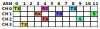
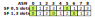
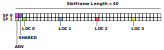
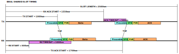
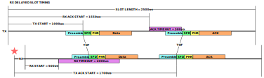

# Wireless Connectivity

This mesh is based on IEEE 802.15.4[^1] Ultra Wide Bandwidth (UWB) radios. IEEE 802.15.4 specifies the physical layer (PHY) and the medium access control (MAC). The IEEE 802.15.4 frame format is shown below.
```
+-------------+-----+------------+---------------------------------------+
| Sync Header | SFD | PHY Header | PHY Payload                           |
| SHR         |     | PHR        | PSDU                                  |
+-------------+-----+------------+------------+-------------+------------+
                    ^            | MAC Header | MAC Payload | MAC Footer |
                    |            | MHR        |             | MFR        |
                    |            +------------+-------------+------------+
IEEE 802.15.4 specifies that timestamps are generated at the start of the PHY (PHY header).
SFD = Start of Frame Delimiter.

+------------------------------------------------------------+---------------+-----+
| MHR                                                        | MAC Payload   | MFR |
+-------------+----------------------------------+-----+-----+-----+---------+-----+
|             | Addressing Fields                |     | HIE | PIE |         |     |
+-------+-----+--------+-------+--------+--------+-----+-----+-----+---------+-----+
| Frame | Seq | Dest   | Dest  | Source | Source | Aux | IE        | Payload | FCS |
| Ctrl  | Num | PAN ID | Addr  | PAN ID | Addr   | Sec |           |         |     |
+=======+=====+========+=======+========+========+=====+=====+=====+=========+=====+
| 1/2   | 0/1 | 0/2    | 0/2/8 | 0/2    | 0/2/8  | var | var       | var     | 2/4 |
+=======+=====+========+=======+========+========+=====+===========+=========+=====+
2 Bytes             Frame Control                   MHR
1 Byte              Sequence Number                 MHR
0/2 Bytes           Destination PAN Identifier      MHR
0/2/8 Bytes         Destination Address             MHR
0/2 Bytes           Source PAN Identifier           MHR
0/2/8 Bytes         Source Address                  MHR
0/5/6/10/14 Bytes   Auxiliary Security Header       MHR
Variable Bytes      Header IE                       MHR         IE
Variable Bytes      Payload IE                      MAC Payload IE
Variable Bytes      Payload                         MAC Payload
2/4 Bytes           FCS                             MFR
```

This mesh network uses 8 byte source and destination addresses which map nicely to the Interface ID portion of an IPv6 address. At the moment, this mesh network forgoes using Source and Destination PAN IDs. Networking with existing systems is achieved by using an encapsulation/compression layer called 6LoWPAN (IPv6 over Low-Power Wireless Personal Area Networks) which allows IPv6 packets to be sent over IEEE 802.15.4 based networks.

Ultra Wide Bandwidth (UWB) radios are used because they provide accurate time measurements of transmitted and received packets, which in turn provides accurate distance measurements.

This mesh uses the Time Slotted Channel Hopping (TSCH) MAC[^2] which is also specified in IEEE 802.15.4. TSCH divides time into equally sized slots. Slots are sized so that one packet can be transmitted and one acknowledgment can be received (if necessary) per slot. Each slot is numbered by an Absolute Slot Number (ASN). The local TSCH network synchronizes on the ASN. Each slot can also have a channel offset. Each slot in the TSCH schedule can be either a TX and/or an RX slot. Furthermore, each slot could be dedicated (one node to one node) or shared (one node to many). Typically, shared slots require some form of transmission backoff in the case of collisions.

<p align="center">
	
	<br>
	<sub><em>Example TSCH schedule. Columns are labeled with Absolute Slot Number (ASN). Rows are labeled with the channel.</em></sub>
</p>

The TSCH schedule consists of slotframes (SF) specified by an ID and a length in number of slots. Slotframes can be added, removed, and modified while the network is running. Likewise, slots can be added, removed, modified to a specific slotframe while the network is running. All slotframes are aligned to timeslot boundaries and ASN 0 is the first repetition of every slotframe.

<p align="center">
	
	<br>
	<sub><em>Example TSCH schedule with 2 slotframes (SF). SF 0 has 5 slots. SF 1 has 3 slots. If occupied slots in multiple slotframes land on the same ASN, the slotframe with the ID closer to 0 takes precedence. ASN 0 is the first slot in every slotframe.</em></sub>
</p>

If two slotframes have two slots in the same position, the slotframe with the smaller ID (closer to 0) takes precedence.

## TSCH Schedule
<p align="center">
	
	<br>
	<sub><em>TSCH schedule for this mesh network. SF 0 is for basic connectivity. SF 1 is for location updates.</em></sub>
</p>

The schedule for this mesh network consists of two slotframes of equal length. The schedule is identical for all nodes in the network.

SF0 slot 0 is a dedicated advertising slot. Prime beacons take turns broadcasting an advertisement packet. Having a dedicated advertising slot provides guarantees for when an advertising packet is transmitted. These guarantees allow for fine tuning of the power requirements for both advertising nodes and listening nodes.

SF0 slot 1 is a shared slot used for transmitting and receiving packets. Having a dedicated shared slot network wide allows a node to be moved around in the network and still maintain basic connectivity. Packet collisions are inevitable in a shared slot. Thus nodes perform a backoff procedure when transmitting packets to transmit successfully in the event of collisions.

SF1 slots 2, 12, 22, 32, are location slots used for updating nodes’ location (see [3D location](3d-location.md)).

## Timing of TSCH Slots[^3]

TSCH slots are sized so that one packet can be transmitted and an acknowledgment can be received. Here are the specifics for this implementation:

<p align="center">
	
	<br>
	<sub><em>Timing of transmissions in one slot. The length of the slot is long enough for one packet to be transmitted and one ack to be received.</em></sub>
</p>

Each slot is 2500 microseconds long. This is a deviation from the IEEE 802.15.4 standard which recommends 10ms slot lengths. 2500 microseconds was chosen because the UWB PHY transmits at a much higher rate than the 2.4 GHz PHY assumed by TSCH as specified in IEEE 802.15.4. Therefore 10ms is unnecessarily long for UWB. Furthermore, 2500 microseconds evenly divides into 10ms so that the UWB TSCH schedule could coexist with a 2.4 GHz TSCH.

The receiving node will turn around and transmit an ACK 1700 us from the start of the slot if the received packet requires an ACK. This is a deviation from the IEEE 802.15.4 standard which recommends the ACK be transmitted TxAckDelay microseconds after receiving a packet. That is, the turnaround time depends on the length of the receiving packet. This is HARD to implement given the features in the UWB radio. It is much easier to base the timings off a common reference point, which in the case of UWB is the timestamp generated in the UWB radio when the Start of Frame Delimiter (SFD) is received.

Another implementation detail is that the receiving node adds the turnaround time to the ACK packet so that the transmitting node can determine the Time of Flight between the two nodes.

TSCH was chosen as the MAC because of its inherent time synchronization capabilities. The largest power draw of this mesh network is the wireless communication. Power can be minimized by turning on the radio at just the right time. Therefore, clocks must be synchronized. However clocks drift. TSCH solves this by 1.) incorporating an RX guard period and 2.) resynchronizing the TX and RX nodes.

<p align="center">
	
	<br>
	<sub><em>TSCH slot showing resynchronization.</em></sub>
</p>

The figure above shows an example where the RX node’s clock is slightly slower than the TX node. Therefore the RX node starts the slot slightly later than the TX node. However, there is enough guard time that the RX node is still able to receive the data packet. The receiving node recomputes the start of the slot (★) once the data packet has arrived and thus resynchronizes to the TX node. The rest of the slot proceeds as normal. Notice that the start of the slot for the RX node (★) is slightly delayed to account for the time of flight from the TX node. This delay is exaggerated in the figure. For reference, 1us = about 300m and the expected distance between nodes is on the order of 5-10m maximum.

[^1]: "IEEE Standard for Low-Rate Wireless Networks," in IEEE Std 802.15.4-2020 (Revision of IEEE Std 802.15.4-2015) , vol., no., pp.1-800, 23 July 2020, doi: 10.1109/IEEESTD.2020.9144691.

[^2]: IEEE 802.15.4-2020 Section 6.2.6 TSCH slotframe structure

[^3]: IEEE 802.15.4-2020 6.5.4.2 Timeslot communication
