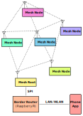

# Hyperspace
The goal of this project is to create a low-power wireless mesh network which can localize nodes in
3D space. Goals of the mesh network:

1.	Nodes should be able to route packets amongst themselves. Nodes should not require a central hub or central server.
2.	Minimize power. Nodes with limited power should be able to participate in the mesh network. Nodes may be powered using energy harvesting (e.g. indoor solar cells).
3.	IPv6 based. Standard internet protocols allow interoperability both with nodes in the mesh and with devices outside the mesh.
4.	Provide 3D location. Nodes should be able to measure their location and automatically configure themselves based on their location. Location services should not require central processing.

## Todo
1.	Tests.
2.	Add NTP to nodes and border router.
3.	Power optimization.
4.	Encryption / Security.
5.	Switch to NRF52840 and DW3000 which will help reduce power and shorten the time required for a location beacon slot (because of the 32 MHz SPI interface).
6.	Live updates of data displayed in the iOS app.
7.	Scripting on the nodes and on the border router. The end goal is for interactions between nodes in the mesh to be programmed in the nodes themselves. The border router needs to enable the user to set and update the various interactions between nodes.
8.	Notifications
9.	Location services. Some means need to be implemented to so that interactions and configurations can be linked to location. Then, nodes need some way to automatically download and configure themselves based on location. One possibility would be for all nodes in the network to store a copy of all configurations/interactions. Then, nodes simply select the appropriate configuration based on node type and location.
10.	Implement IPv6 Router Advertisements directly into **border-router** to remove the dependency on `radvd`.
11.	Custom url for the **border-router** home page.
12.	https.
14.	QR codes or some other printed AR tag.
13.	Debug sources of error in the AR app.

## Motivation
There are a number of problems with present-day smart home devices. First, present-day smart devices typically require a central hub which contains the processing for the interactions between the smart devices. Typically the hub will also require internet access to enable the smart functionality. For example, suppose one has a present-day smart light switch which is programmed to turn on a present-day smart light bulb. The switch, when activated, sends a packet to the hub which processes the packet, recognizes that the light bulb needs to be turned on, and sends a new packet to the light bulb to turn on. The problem with this approach is that the smart devices are effectively bricked if the hub loses power.

Furthermore, some present-day smart devices require an internet connection for some functionality. For example, suppose the user wants to view and change the settings on a present-day smart thermostat from their smart phone. Functionally, both the app on the smart phone and the smart thermostat itself connect to the company’s remote server even if both the phone and the thermostat are on the user’s WIFI network. This means that the thermostat is partially disabled if the company shuts down the server or if internet connectivity is lost.

The brittleness inherent in a central point of failure can be overcome by using a wireless mesh network. A mesh network allows devices to communicate with each other without the need for a central hub. In this scheme the smart switch can send a packet directly to the smart light bulb. Functionality is not lost if the hub loses power or if the internet goes down. In essence, the hub becomes just a dumb portal to the internet.

The second problem is that present-day smart devices require some form of pairing procedure to join the network, which is a degradation of user experience. Compare:

1.	The user needs to replace a dumb light bulb in the kitchen. The user goes to the store, buys a new light bulb and screws it in. The light bulb just works.

2.	The user needs to replace a smart light bulb in the kitchen. The user goes to the store, buys a new light bulb and screws it in. The user then needs to identify the light bulb to the central hub and program the interactions for the smart bulb. A location-based wireless mesh network can solve this problem. Smart devices could configure themselves based on their 3D location. Consider the following:

3.	 The user needs to replace a location-based smart light bulb in the kitchen. The user goes to the store, buys a new light bulb, and screws it in. The light bulb performs the localization procedure and determines that it is located in the kitchen. The light bulb then downloads the relevant interactions for a light bulb in the kitchen.
The benefits of this mesh network are many. First, it allows rich interactions. Any smart switch can be reprogrammed to control light bulbs, outlets, appliances, etc. With existing infrastructure, the user would need to rewire a room in order to put in another switch. However, with smart switches, the user could put in a 3-way or 4-way switch with no extra cost except for the cost of the switch itself and the time required to program the new interaction in the switch.

## Introduction
<p align="center">
	
</p>

This project consists of the following elements:

1.	**border-router**: Software running on a Raspberry Pi. The border router acts as a bridge between nodes in the UWB mesh and computers in the user's LAN or WIFI network. The border router also runs a web server so that the user can monitor and interact nodes in the network.
	
2.	**hypertun**: Linux TUN device which bridges the border-router and **mesh-root**.
3.	**mesh-root**: Firmware running on the device that is connected to the border router. There is no theoretical difference between **mesh-root** and **mesh-beacon**, but for development **mesh-root** enables the slave SPI interface while **mesh-beacon** doesn't. The board is a Decawave MDEK1001 UWB development boards. Note: SPI was used instead of UART because there wasn't a free UART from the MDEK1001 dev kit. I wanted to use the UART from the dev kit to output serial logs to the development computer. The SPI slave is incredibly simple and only transmits/receives IPv6 packets as an array of bytes (no registers to read to and write from. If data needs to be requested from the **mesh-root**, it needs to be done through IP networking). One downside to the NRF52832 is that the SPI interface is limited to transfers of a maximum of 255 bytes. This means that packets larger than this amount will not be transmitted/received correctly. I intentionally have not fixed this issue as I will switch to the NRF52840 at some point which does not have this limitation.
4.	**mesh-beacon**: Firmware running on devices deployed in the mesh. This firmware allows nodes to become location beacons. The board is a Decawave MDEK1001.
5.	**mesh-nonbeacon**: Exactly the same as **mesh-beacon** except that location beacons are disabled; mesh-nonbeacon will only perform TDOA.
6.	**app-ios**: App running on a user's iPhone. The app utilizes Apple's RealityKit to scan and upload the user's home to the border-router. The app also initially calibrates the nodes' reported location to their actual location in the home. Finally, the app overlays nodes' information in the virtual scene (WIP).

## Topics
1. [Wireless Connectivity](docs/wireless-connectivity.md) describes how nodes communicate.
2. [3D Location](docs/3d-location.md) describes how nodes cooperate to measure their location.
3. [Mesh Routing](docs/mesh-routing.md) describes how packets are routed in the mesh network.
4. [Error Handling](docs/error-handling.md)

## Getting Started
Development was done using the Decawave [MDEK1001](https://www.decawave.com/product/mdek1001-deployment-kit/) dev kit and a Raspberry Pi. When setting up a new board, first build and flash the bootloader with CONFIG_BOOT_SIGNATURE_TYPE_ED25519=y (this is automated when starting the "Launch bootloader" Run and Debug task in vscode). Then, the signed hex firmware can be flashed to the board (flashing the hex file does not erase the bootloader). The build tasks and debug tasks in vscode take care of setting up a terminal's environment, building the firmware, and then signing the firmware (see `build-and-sign.cmd`). As a custom step for signing firmware, I append an MCUBoot TLV header that describes the manufacturer, board, and firmware version. This "manuf,board,fwver" string is generated by `fw_version.h`. As part of the signing stage of the build script, `fw_version.cmd` extracts the "manuf,board,fwver" string from `fw_version.h` and passes this string to `west sign`. For now, the private key is the default ED25519 key distributed by mcuboot.

When starting up the system from scratch, I first ssh into the Raspberry Pi and set up a tun device and start radvd (see *Setup radvd* for creating a tun device and starting radvd).

Next, I start debugging **border-router**. In a web browser, I navigate to http://raspberrypi.local:5000/ to verify that the web page is up.

Then, I start debugging **mesh-root** and the **mesh-beacon**. One MDEK1001 has a header soldered to it and sits atop a Raspberry Pi. This MDEK1001 hat has the **mesh-root** firmware flashed to it and acts as a bridge between the mesh network and the Raspberry Pi. The Raspberry Pi communicates with the **mesh-root**, and the rest of the network, using `hypertun`, a `tun` device integrated with the **border-router** software running on the Pi, which has an IPv6 subnet assigned to it (see *Setup radvd* below).

IPv6 Router Advertisements need to be manually sent from the Raspberry Pi over `hypertun` so that the **mesh-root** can learn the mesh's IPv6 prefix. The **mesh-root** and **mesh-beacons** will randomly send advertisements as well so that joining nodes can learn the network's prefix. IPv6 addresses in the mesh are currently assumed to be unique. Currently no Duplicate Address Detection is performed. The nodes' IPv6 address is assigned directly from the NRF52832 DEVICEID register, which is also used as the link-layer address for IEEE 802.15.4.

In my test network I have 6 beacons: 1 beacon attached to the Raspberry Pi as the **mesh-root**, and 5 other **mesh-beacons**. The Raspberry Pi and 4 other beacons are attached to a wall and form beacons 0, 4, 8 (2), 9, 13. One other beacon is sitting on a table on the other side of the room and acts as beacon 19. I've adjusted LATTICE_R to be small corresponding to the short distances between my test beacons. Todo: In a real network, LATTICE_R needs to be set to roughly match the radio range of the nodes. When starting up the network, I start the nodes in a specific order so that the nodes assign themselves the desired beacon index (0, 4, 9, 13, 8 (2)).

Note: I currently don't place a node where beacon 2 should actually be placed. This allowed me to discover a bug: If beacon 8 were to join the network as beacon 8, it would cease updating its location because it would have no prime beacon in its local neighborhood (just 4 and 8). The location would not get updated and after awhile the node would drop off the network only to rejoin moments later. This process would repeat for ever until a node just happened to be placed where beacon 2 should be. Therefore, to fix this issue, nodes must first try and become the prime beacon in order to keep updating its location. Then, once a node is placed where the actual prime beacon should be, the other nodes would pick a more suitable beacon for their location. Hence, for now, beacon 8 reports itself as beacon 2.

I have multiple debug configurations which are all identical except that they target specific debugger serial numbers. That way, I know that "Launch mesh-beacon-1" will program the node located at beacon 4 as long as I don't move the node.

Once the beacons are started and have joined the mesh, they periodically send a CoAP packet to the border router with some status updates. This packet is reflected in the border router's "Devices" or "Reports" page. Once I see that all 6 nodes are updating periodically, I start scanning and calibrating the physcial environment. I load the "Hyperspace" iOS app onto my iPhone and start the app. The app detects that no AR state is stored on the border router and asks me to scan my environment. Once done, the app uploads the RealityKit state and a 3D OBJ model of the environment to the border router and transitions to the calibration state. I point the camera at the physical location of the beacons and press "Ray". This casts a ray in the AR scene to get the location targeted by the crosshair and then shows a list of IP addresses in the mesh network. I select the IP address of the node I targeted. The app stores a list of {ip address, reported location, and physical location}. Once I have more than 4 points, or I've scanned all nodes in the mesh, I click done calibrating. The app then uploads the calibration list to the border router which then performs and stores the calibration in `calib.json`. The app then draws holder text placed at the physical location of the nodes in the scene.

This is an explanation of the data used to calibrate the physical location of the nodes.

- ip address: the ip address of the node. Currently there is no automated way detect a unique identifier or IP address from the nodes. I've drawn a diagram on a piece of paper to help me remember the ip addresses at specific locations. Todo: QR codes or some other printed AR tag?
- reported location: the location as measured by the nodes themselves. This is reported to the border router using periodic CoAP packets.
- physical location: the location of the node in the AR scene as measured by the iPhone.

The border router takes the above list of data points and performs the Kabsch algorithm to align the nodes' reported location to the physical location. The app then uses this calibration to take a node's reported location and transform it to a physical location in the AR scene. Note that the calibration is not currently sent to the nodes in the mesh network.

The AR scene and calibration data is stored in the border router. When the iOS app starts up, it tries to download any existing state and only asks to scan and calibrate if there is missing state. Therefore, multiple iPhones inspecting the same AR scene should already be supported. Furthermore, if I have to start and stop the border router frequently, I'll download the AR scene data, obj file, and calib.json from the border router and upload the data automatically when starting a new debug session. This prevents me from having to rescan and recalibrate over and over again. Do this by including the following lines in `hyperspace-border-router.csproj` with the AR state stored locally in border-router/worldmap/:

```
<ItemGroup>
	<ContentWithTargetPath Include="worldmap/calib.json" TargetPath="worldmap/calib.json" CopyToOutputDirectory="PreserveNewest" />
	<ContentWithTargetPath Include="worldmap/worldmap.ios" TargetPath="worldmap/worldmap.ios" CopyToOutputDirectory="PreserveNewest" />
	<ContentWithTargetPath Include="worldmap/worldmap.obj" TargetPath="worldmap/worldmap.obj" CopyToOutputDirectory="PreserveNewest" />
</ItemGroup>

<!-- Override the default behavior which aggressively copies json files to the output
		directory -->
<ItemGroup>
	<Content Update="worldmap/calib.json" CopyToOutputDirectory="Never" CopyToPublishDirectory="Never" />
</ItemGroup>
```

## Setup
### Setup Raspberry Pi
1.	Create a folder for the border router: `mkdir ~/hyperspace/`
2.	Install required programs:
	```
	sudo apt-get update
	sudo apt-get full-upgrade
	sudo apt-get install apache2 postgresql postgis radvd
	```
3.	Setup SSH
	1.	Generate ssh keys on the development machine (not the Raspberry Pi) if required: `ssh-keygen`
	2.	Copy the development machine's SSH public key to the Raspberry Pi: `cat ~/.ssh/id_rsa.pub | ssh pi@raspberrypi.local "mkdir ~/.ssh; cat >> ~/.ssh/authorized_keys"`
	3.	The final result should be that the developement machine can ssh into the Raspberry Pi without needed to provide a password: `ssh pi@raspberrypi.local`
4.	Setup dotnet
	0.	https://docs.microsoft.com/en-us/dotnet/core/install/linux-scripted-manual#manual-install
	1.	https://docs.microsoft.com/en-us/dotnet/core/install/linux-debian#debian-9-

	1.	Manual Install
		1.	Go to https://dotnet.microsoft.com/en-us/download/dotnet/6.0 and click on Linux Arm32 binaries to start the download. Copy the direct link.
		2.	On the raspberry pi, `cd ~`
		3.	`wget <paste link>`
		4.	Once download completes, `mkdir /usr/share/dotnet`
		5.	`tar zxf dotnet-sdk-<whatever was just downloaded> -C /usr/share/dotnet`
		6.	Optional (debug configurations hardcode the path to dotnet so these are not required):
			1.	`export PATH=$PATH:/usr/share/dotnet`
			2.	`export DOTNET_ROOT=/usr/share/dotnet`
			3.	Alternatively, add 6. and 7. to ~/.bash_profile, ~/.bashrc if using Bash.
	2.	Setup remote debug: https://docs.microsoft.com/en-us/dotnet/iot/debugging?tabs=self-contained&pivots=vscode.
5.	Setup Apache
	0.	https://thomaslevesque.com/2018/04/17/hosting-an-asp-net-core-2-application-on-a-raspberry-pi/
	1.	https://docs.microsoft.com/en-us/aspnet/core/host-and-deploy/linux-apache?view=aspnetcore-5.0
	```
	sudo apt install apache2 -y
	sudo apachectl start
	```
	http://raspberrypi should show the default Apache webpage.
	```
	cd /etc/apache2
	```
	In `apache2.conf`, under the Global configuration section, add `ServerName raspberrypi.local`.
	```
	sudo a2enmod headers proxy proxy_http proxy_html
	cd sites-available
	sudo vim hyperspace-border-router.conf and paste the following:

	<VirtualHost *:*>
		RequestHeader set "X-Forwarded-Proto" "expr=%{REQUEST_SCHEME}"
	</VirtualHost>

	<VirtualHost *:80>
		ProxyPreserveHost On
		ProxyPass / http://127.0.0.1:5000/
		ProxyPassReverse / http://127.0.0.1:5000/
		ServerName www.raspberrypi.local
		ServerAlias *.raspberrypi.local
		ErrorLog ${APACHE_LOG_DIR}hyperspace-border-router-error.log
		CustomLog ${APACHE_LOG_DIR}hyperspace-border-router.log common
	</VirtualHost>

	sudo a2ensite hyperspace-border-router
	apachectl configtest should return Syntax OK
	sudo apachectl restart
	Todo: have apache manage the app using systemd.
	```
6.	Setup PostgreSQL databases. Note, edit `appsettings.Development.json` and `appsettings.json` to include the database password:
	```
	"ConnectionStrings": {
		"HyperspaceConnectionString": "Host=localhost;Username=pi;Password=<password>;Database=hyperspace;"
	}
	```
	```
	sudo su postgres
	createuser pi -P --interactive
	Enter password for new role:
	Enter it again:
	Shall the new role be a superuser? (y/n) y
	psql
	CREATE DATABASE hyperspace;
	\connect hyperspace;
	CREATE EXTENSION postgis;

	CREATE TABLE devices (
		"ip" INET PRIMARY KEY,
		"updated_at" TIMESTAMPTZ NULL,
		"r" REAL NULL,          /* Hyperspace coordinate radius */
		"t" REAL NULL,          /* Hyperspace coordinate theta  */
		"seq" INTEGER NULL,     /* Hyperspace coordinate seqnum */
		"image_0" TEXT NULL,
		"image_1" TEXT NULL,
		"coap_well_known" TEXT NULL
	);

	CREATE TABLE reports (
		"ip" INET references devices(ip),
		"updated_at" TIMESTAMPTZ NULL
	);

	SELECT AddGeometryColumn('reports', 'loc', -1, 'POINT', 3);
	ALTER TABLE reports ADD COLUMN report JSONB NOT NULL DEFAULT '{}'::jsonb;
	CREATE INDEX reports_loc ON reports USING GIST (loc);

	CREATE FUNCTION public.notify_on_data_change()
		RETURNS trigger
		LANGUAGE 'plpgsql'
	AS $BODY$
	DECLARE
		data JSON;
		notification JSON;
	BEGIN
		IF (TG_OP = 'DELETE') THEN
			data = row_to_json(OLD);
		ELSE
			data = row_to_json(NEW);
		END IF;

		notification = json_build_object(
			'table', TG_TABLE_NAME,
			'action', TG_OP,	-- INSERT, UPDATE, DELETE
			'data', data);

		PERFORM pg_notify('data_changed', notification::TEXT);
		RETURN NEW;
	END$BODY$;

	CREATE TRIGGER "OnDataChange"
	AFTER INSERT OR DELETE OR UPDATE
	ON public.devices
	FOR EACH ROW
	EXECUTE PROCEDURE public.notify_on_data_change();

	CREATE TRIGGER "OnDataChange"
	AFTER INSERT OR DELETE OR UPDATE
	ON public.reports
	FOR EACH ROW
	EXECUTE PROCEDURE public.notify_on_data_change();

	\q (to exit psql)
	exit (returns to the pi user)
	```
	Edit the PostgreSQL config file `/etc/postgresql/9.6/main/postgresql.conf` to uncomment the `listen_addresses` line and change its value from `'localhost'` to `'*'`. Save and exit.

	Edit the `pg_hba` config file `/etc/postgresql/9.6/main/pg_hba.conf` to change `127.0.0.1/32` to `0.0.0.0/0` for IPv4 and `::1/128` to `::/0` for IPv6. Save and exit.

	`sudo service postgresql restart`

7.	Setup radvd
	```
	sudo vim /etc/radvd.conf
	interface tun0 {
		AdvSendAdvert on;
		MinRtrAdvInterval 3;
		MaxRtrAdvInterval 10;
		prefix fd00::/64 {
			AdvOnLink on;
			AdvAutonomous on;
			AdvRouterAddr on;
		};
	};
	sudo ip tuntap add mode tun user $USER
	sudo ip link set tun0 up
	sudo ip addr add "fd00::1/8" dev tun0
	sudo radvd
	ip tuntap
	sudo tcpdump -vv -i tun0
	```
	Finally, optionally dump packets from tun0: `sudo tcpdump -vv -i tun0`

### Setup Development Machine (Windows)
1.	Install the following programs:
	1.	gcc-arm-none-eabi (Todo: remove gcc-arm-none-eabi in favor of clang?) https://developer.arm.com/tools-and-software/open-source-software/developer-tools/gnu-toolchain/gnu-rm/downloads
	2.	Setup Visual Studio Code
		1.	Install vscode. https://code.visualstudio.com/
		2.	Install the following extensions: ms-vscode.cpptools, ms-dotnettools.csharp, marus25.cortex-debug,
	3.	Install node.js. https://nodejs.org/en/
2.	Setup Zephyr
	1.	Install Ninja. https://github.com/ninja-build/ninja/releases
	2.	Install cmake. https://cmake.org/download/
	3.	Create an environment variable `ZEPHYR_TOOLCHAIN_VARIANT` with value `gnuarmemb`.
	4.	Install west. https://docs.zephyrproject.org/latest/guides/west/install.html
	5.	Initialize zephyrproject
		```
		west init -m https://github.com/kurthildebrand/zephyr.git --mr hyperspace zephyrproject
		cd zephyrproject
		west update
		cd zephyr
		git remote rename origin github
		git remote add upstream https://github.com/zephyrproject-rtos/zephyr.git
		```
	6.	For building firmware
		1.	If running in a new terminal, run `zephyrproject/zephyr/zephyr-env.cmd` first which sets environment variables required by Zephyr.
		2.	`cd` into the project directory, for example `cd mesh-root`.
		3.	`west build` (which should create `build/` for you and setup `cmake`).
		4.	Alternatively,
			```
			mkdir build
			cd build
			cmake ../ -G Ninja
			cd ../
			west build
			```
3.	Setup clang/llvm
	1.	Install Visual Studio. Community version is fine. https://visualstudio.microsoft.com/
	2.	In `C:\`, run the following (building llvm could take a long time):
		```
		git clone https://github.com/llvm/llvm-project.git
		cd llvm-project
		mkdir build
		cd build
		cmake -DLLVM_ENABLE_PROJECTS="clang;clang-tools-extra;lld" -DLLVM_TARGETS_TO_BUILD="all" ../llvm
		```
	3.	Open `LLVM.sln` in Visual Studio 2022 and build either the `Release` or `MinSizeRel` configurations. This could take a long time.
	4.	Add the following to the System Path: `C:\llvm-project\build\Release\bin`, `C:\llvm-project\build\bin`.
4.	Setup Raspberry Pi cross-compilation (required for building `HyperTun`)
	1.	Sysroot can be found at https://developer.arm.com/tools-and-software/open-source-software/developer-tools/gnu-toolchain/gnu-a/downloads. I used https://developer.arm.com/-/media/Files/downloads/gnu-a/10.3-2021.07/binrel/gcc-arm-10.3-2021.07-mingw-w64-i686-arm-none-linux-gnueabihf.tar.xz
	2.	Download and extract to `/border-router/../gcc-arm-10.3-2021.07-mingw-w64-i686-arm-none-linux-gnueabihf/` (That is, extract one level above `border-router/`).
	3.	Update `rpi.toolchain.cmake` to set `CMAKE_SYSROOT` to the extracted sysroot, for example:
		```
		set(CMAKE_SYSROOT ${CMAKE_CURRENT_LIST_DIR}/gcc-arm-10.3-2021.07-mingw-w64-i686-arm-none-linux-gnueabihf/arm-none-linux-gnueabihf/libc)
		```
5.	Setup dotnet on the development machine (Todo)
	1.	Download and install the dotnet sdk: https://dotnet.microsoft.com/en-us/download
	2.	Running `dotnet` in a terminal should output:
		```
		Usage: dotnet [options]
		Usage: dotnet [path-to-application]

		Options:
		-h|--help         Display help.
		--info            Display .NET information.
		--list-sdks       Display the installed SDKs.
		--list-runtimes   Display the installed runtimes.

		path-to-application:
		The path to an application .dll file to execute.
		```
